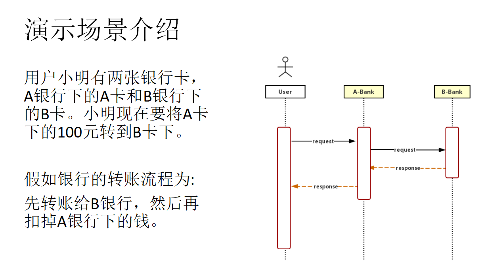

# TX-LCN springcloud 示例代码

SpringCloud下如何搭建TX-LCN分布式事务

讲解步骤：
* 依赖环境准备   
* 演示场景介绍  
* Tx-Manager(TM)环境搭建  
* 微服务搭建  
* Tx-Client(TC)环境搭建  
* 场景演练   

视频地址:    
https://youtu.be/PUACgQG52Ao

PPT:   
[TX-LCN-SpringCloud.pptx](TX-LCN-SpringCloud.pptx)

TX-LCN分布式事务官网：  
www.txlcn.org  
